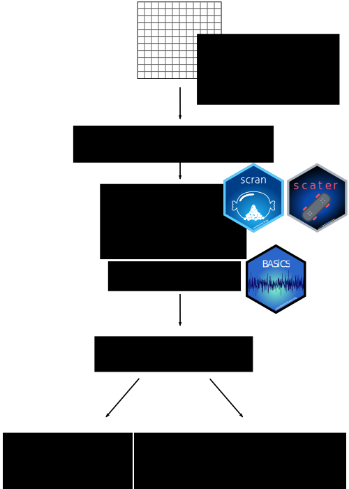

```{r setup_knitr, include = FALSE, cache = FALSE}
library("BiocStyle")
## Decide whether to display parts for BioC (TRUE) or F1000 (FALSE)
on.bioc <- FALSE
library("knitr")
library("ggplot2")
theme_set(theme_bw())
# Use fig.width = 7 for html and fig.width = 6 for pdf
# fig.width <- ifelse(on.bioc, 10, 6)
if (knitr::is_html_output()) {
  out_width <- "700px"
  out_height <- "600px"
} else if (knitr::is_latex_output()) {
  out_width <- "2.5in"
  out_height <- "3.5in"
}
knitr::opts_chunk$set(
  warning = FALSE, message = FALSE, error = FALSE,
  cache = 2, cache.path = "cache_main/",
  # fig.pos = "h",
  fig.path = "figure/"
)
```


# Introduction

<!--- scRNA-seq and the different types of heterogeneity ---> 
<!--- Nils to revisit and add additional references if required --->
Single-cell RNA-sequencing (scRNA-seq) enables the study of genome-wide 
transcriptional heterogeneity in cell populations that is not 
captured by bulk experiments [@Stegle2015; @Prakadan2017; @Patange2018]. 
On the broadest level, this heterogeneity can reflect the presence of distinct 
cell subtypes or states. 
Alternatively, it can be due to gradual changes along biological processes, 
such as development and differentiation. 
Several clustering and pseudotime inference methods have been developed to
characterise these types of heterogeneity [@Kiselev2019; @Saelens2019].
However, there is a limited availability of computational tools tailored 
to study more subtle variability within seemingly homogeneous cell populations. 
This variability can reflect deterministic or stochastic events that regulate
gene expression and, among others, has been reported to increase prior to cell
fate decisions [@Mojtahedi2016] as well as during ageing [@Martinez-jimenez2017]. 

<!--- Describes aims for the workflow and introduces BASiCS ---> 
This article complements existing scRNA-seq workflows based on the Bioconductor 
ecosystem (e.g. [@Lun2016; @Kim2019]), providing a detailed framework for 
transcriptional variability analyses. 
Firstly, we briefly discuss the sources of variability that arise in scRNA-seq 
data and the strategies that have been designed to control or attenuate 
technical noise in these assays. 
Subsequently, we describe a step-by-step workflow which uses
`r Biocpkg("scater")` [@McCarthy2017] and `r Biocpkg("scran")` [@Lun2016] 
to perform quality control (QC) as well as initial exploratory analyses. 
To robustly quantify transcriptional variability we use `r Biocpkg("BASiCS")` 
[@Vallejos2015; @Vallejos2016; @Eling2017] --- a Bayesian hierarchical framework 
that jointly performs data normalisation, technical noise quantification and 
downstream analyses, whilst propagating statistical uncertainty across these 
steps. 
Our analysis pipeline includes practical guidance to assess the convergence of 
the Markov Chain Monte Carlo (MCMC) algorithm that is used to infer model 
parameters as well as recommendations to interpret and post-process the model 
outputs. 
Finally, through a case study in the context of immune cells, we illustrate
how `r Biocpkg("BASiCS")` can be used to identify highly and lowly variable
genes within a cell population, as well as to compare expression profiles
between experimental conditions or cell types. 

All source code used to generate the results presented in this article is 
available [on Github](https://github.com/VallejosGroup/BASiCSWorkflow).
To ensure the 
reproducibility of this workflow, the analysis environment and all software 
dependencies are provided as a Docker image [@Boettiger2015]. The image 
can be obtained from
[Docker Hub](https://hub.docker.com/repository/docker/alanocallaghan/bocker).

# Sources of variability in scRNA-seq data

Stochastic variability within a seemingly homogeneous cell population --- often 
referred to as transcriptional *noise* --- can arise from intrinsic and 
extrinsic sources [@Elowitz2002; @Eling2019]. 
Extrinsic noise refers to stochastic fluctuations induced by 
different dynamic cellular states (e.g. cell cycle, metabolism, 
intra/inter-cellular signalling) [@Zopf2013; @Iwamoto2016; @Kiviet2014]. 
In contrast, intrinsic noise arises from stochastic effects on biochemical 
processes such as transcription and translation [@Elowitz2002].
Intrinsic noise can be modulated by genetic and epigenetic modifications (such 
as mutations, histone modifications, CpG island length and nucleosome 
positioning) [@Eberwine2015; @Faure2017; @Morgan2018] and usually occurs 
at the gene level [@Elowitz2002]. 
Cell-to-cell gene expression variability estimates derived from scRNA-seq data 
capture a combination of these effects, as well as deterministic regulatory 
mechanisms [@Eling2019]. 
Moreover, these variability estimates can also be inflated by the technical 
noise that is typically observed in scRNA-seq data [@Brennecke2013].

<!--- Experimental strategies to tackle technical noise --->
Different strategies have been incorporated into scRNA-seq protocols to control 
or attenuate technical noise. 
For example, external RNA spike-in molecules (such as the set introduced by the 
External RNA Controls Consortium, ERCC [@Rna2005]) can be added to each cell’s 
lysate in a (theoretically) known fixed quantity.
Spike-ins can assist quality control steps [@McCarthy2017], data normalisation
[@Vallejos2017] and can be used to infer technical noise [@Brennecke2013].
Another strategy is to tag individual cDNA molecules using unique molecular 
identifiers (UMIs) before PCR amplification [@Islam2014]. 
Reads that contain the same UMI can be collapsed into a single molecule count,
attenuating technical variability associated to cell-to-cell differences
in amplification and sequencing depth (these technical biases are not fully 
removed unless sequencing to saturation [@Vallejos2017]). 
However, despite the benefits associated to the use of spike-ins and UMIs, 
these are not available for all scRNA-seq protocols [@Haque2017].


# Methods {#methods}

This step-by-step scRNA-seq workflow is primarily based on the Bioconductor 
package ecosystem [@Amezquita2019]. 
A graphical overview is provided in Figure \@ref(fig:overview) 
and its main components are described below. 

```{r overview, out.width=out_width, out.height=out_height, fig.cap = 'Graphical overview for the scRNA-seq analysis workflow described in this manuscript. Starting from a matrix of expression counts, we use the scater and scran Bioconductor packages to perform QC and initial exploratory analyses. To robustly quantify transcriptional heterogeneity within seemingly homogeneous cell populations, we apply the BASiCS Bioconductor package and  illustrate how BASiCS can be used to analyse a single or multiple pre-specified groups of cells.', echo=FALSE}

```

## Input data

```{r}
library("SingleCellExperiment")
```

We use `r Biocpkg("SingleCellExperiment")` to convert an input
matrix of raw read-counts (molecule counts for UMI-based protocols) into a 
`SingleCellExperiment` object which can also store its associated 
metadata, such as gene- and cell-specific information. 
Moreover, when available, the same object can also store read-counts for 
spike-in molecules (see `altExp()`).
A major advantage of using a `SingleCellExperiment` object as the input for 
scRNA-seq analyses is the interoperability across a large number of 
Bioconductor packages [@Amezquita2019]. 

## Quality control and exploratory analysis

```{r}
library("scater")
library("scran")
```

An critical step in scRNA-seq analyses is QC, removing low quality samples that 
may distort downstream analyses. 
Among others, QC diagnostics can help to identify samples that contain broken 
cells, that are empty or that contain multiple cells [@Ilicic2016]. 
Moreover, lowly expressed genes for which less reliable information is 
available are typically also removed. 
The [*OSCA*](https://osca.bioconductor.org/) online book provides an extensive
overview on important aspects of how to perform QC of scRNA-seq data, including
exploratory analyses [@Amezquita2019].

Here, we use the `r Biocpkg("scater")` package [@McCarthy2017] to calculate 
QC metrics for each cell (e.g. total read-count) and gene (e.g. percentage of 
zeroes across all cells), respectively. 
Moreover, we use the visualisation tools implemented in `r Biocpkg("scater")` to 
explore the input dataset and its associated QC diagnostic metrics. 
For further data exploration we use the `r Biocpkg("scran")` package [@Lun2016].
`r Biocpkg("scran")` can perform *global scaling* normalisation, calculating 
cell-specific scaling factors that capture global differences in read-counts 
across cells (e.g. due to sequencing depth and PCR amplification) 
[@Lun2016pooling]. 
Moreover, `r Biocpkg("scran")` enables exploratory analyses of transcriptional
variability. 
For example, it can be used to infer an overall trend between mean expression 
and the squared coefficent of variation (CV^2^) for each gene. 
To derive variability estimates that are not confounded by this overall trend, 
`r Biocpkg("scran")` also defines gene-specific DM (distance to the mean) 
estimates as the distance between CV$^2$ and a rolling median along the range 
of mean expression values [@Kolodziejczyk2015cell].
DM estimates enable exploratory analyses of cell-to-cell heterogeneity, but a
measure of uncertainty is not readily available. As such, gene-specific 
downstream inference (e.g. differential variability testing) is precluded.


```{r}
library("ggplot2")
```


<!--- BASiCS downstream analyses within a single population 
Within a population of cells, `r Biocpkg("BASiCS")` decomposes the total 
observed variability in expression measurements into technical and biological 
components [@Vallejos2015]. 
This enables the identification of *highly variable genes* (HVGs) that capture
the major sources of heterogeneity within the analysed cells [@Brennecke2013]. 
HVG detection is often used as feature selection, to identify the input 
set of genes for subsequent analyses. 
`r Biocpkg("BASiCS")` can also highlight *lowly variable genes* (LVGs) that 
exhibit stable expression across the population of cells.
These may relate to essential cellular functions and can assist the development
of new data normalisation or integration strategies [@Lin2019]. --->

<!--- BASiCS downstream analyses between populations 
`r Biocpkg("BASiCS")` also provides a probabilistic decision rule to 
perform differential expression analyses between two (or more) pre-specified 
groups of cells [@Vallejos2016; @Eling2018].
Whilst several differential expression tools have been proposed for scRNA-seq 
data (e.g. [@Kharchenko2014; @Finak2015]), some evidence suggests that 
these do not generally outperform popular bulk RNA-seq tools [@Soneson2018]. 
Moreover, most of these methods are only designed to uncover changes in overall
expression, ignoring the more complex patterns that can arise at the single cell 
level [@Lahnemann2020]. 
Instead, `r Biocpkg("BASiCS")` embraces the high granularity of scRNA-seq data,
uncovering changes in cell-to-cell expression variability that are not 
confounded by differences in technical noise or in overall expression. --->


